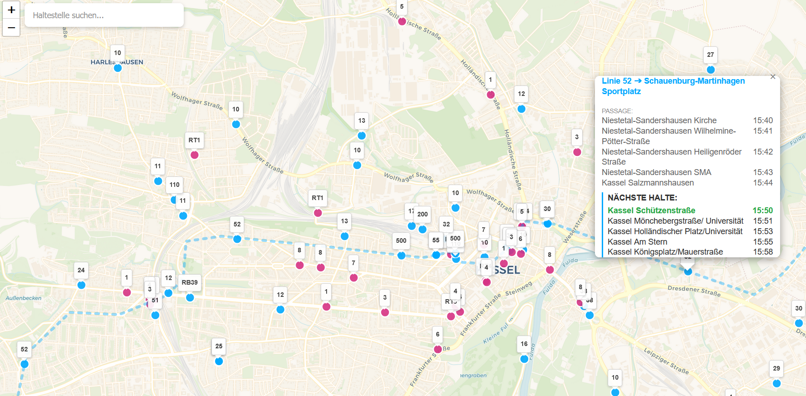

# Kassel Live Transit Radar 🛰️🚌



A real-time transit visualization dashboard...

## 🌟 Features

- **Live Vehicle Tracking:** Trams and buses move in real-time based on GTFS stop-time interpolation.
- **Route Visualization:** Click on any vehicle to see its full intended path and upcoming stops.
- **Stop Schedules:** Click on any station to see a live departure board for the next 60 minutes.
- **Smart Search:** Quickly find and zoom to any transit stop in the network.
- **Light/Modern UI:** Clean, Google-Maps-style interface with a discrete system clock for sync verification.

## 🛠️ Tech Stack

- **Backend:** Python (Flask, Pandas)
- **Frontend:** JavaScript (Leaflet.js)
- **Styling:** CSS3 (Glassmorphism & Responsive Design)
- **Data Format:** GTFS (General Transit Feed Specification)

## 🚀 Getting Started

### Prerequisites
- Python 3.x
- `pip install flask flask-cors pandas`

### Installation
1. Clone this repository:
   ```bash
   git clone [https://github.com/ViezTrinker/kassel-live-radar.git](https://github.com/ViezTrinker/kassel-live-radar.git)